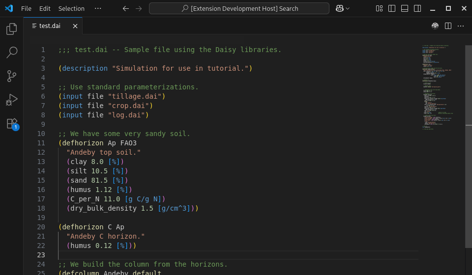
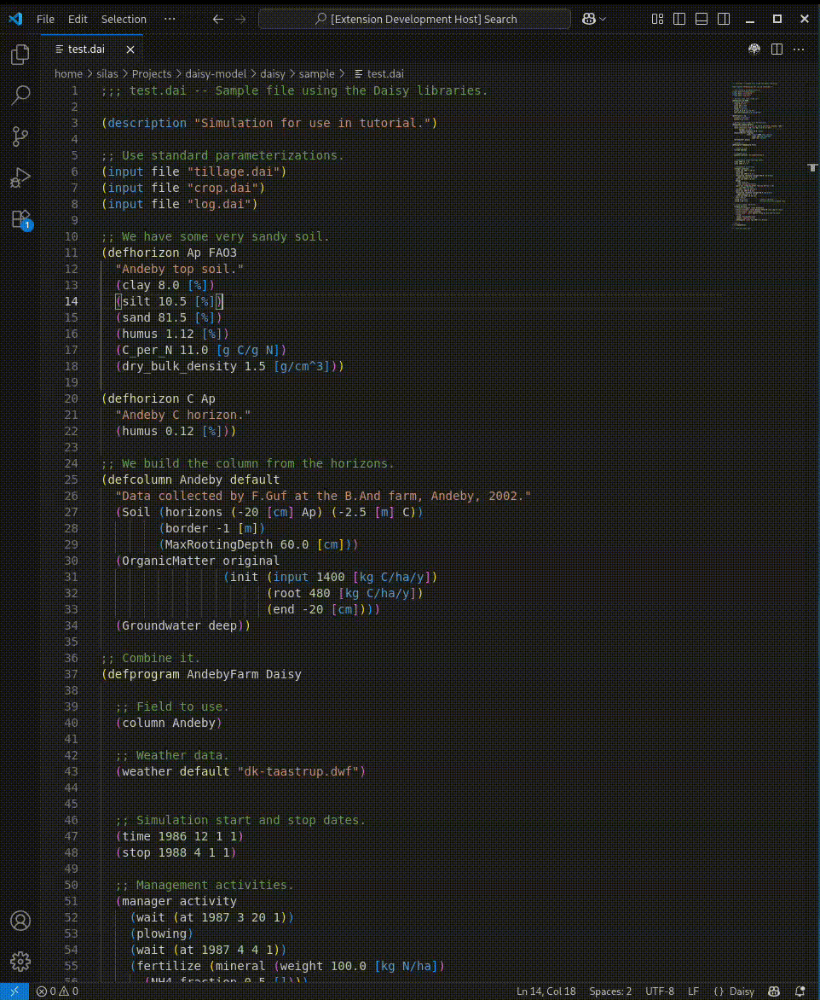

# Daisy VSCode extension

This VSCode extension provides language support for [Daisy](https://daisy.ku.dk/) setup files (`.dai`) and a command for running Daisy from VSCode. See also (https://github.com/daisy-model/daisy)

## Features

### Syntax highlighting of `.dai`files



### Running Daisy


## Extension Settings

This extension contributes the following settings:

* `Daisy.home`: Full path to Daisy home directory containing lib/ and sample/ directories.
* `Daisy.executable`: Name(s) and full path(s) to Daisy executable(s) given as an array of "name", "path" pairs. For example,
```{json}
[
    {
        "name": "daisy-v7.1.0",
        "path": "C:/Program Files/daisy 7.1.0/bin/daisy.exe"
    },
    {
        "name": "daisy-v7.1.0_no-python",
        "path": "C:/Program Files/daisy 7.1.0_no-python/bin/daisy.exe"
    }
]
```